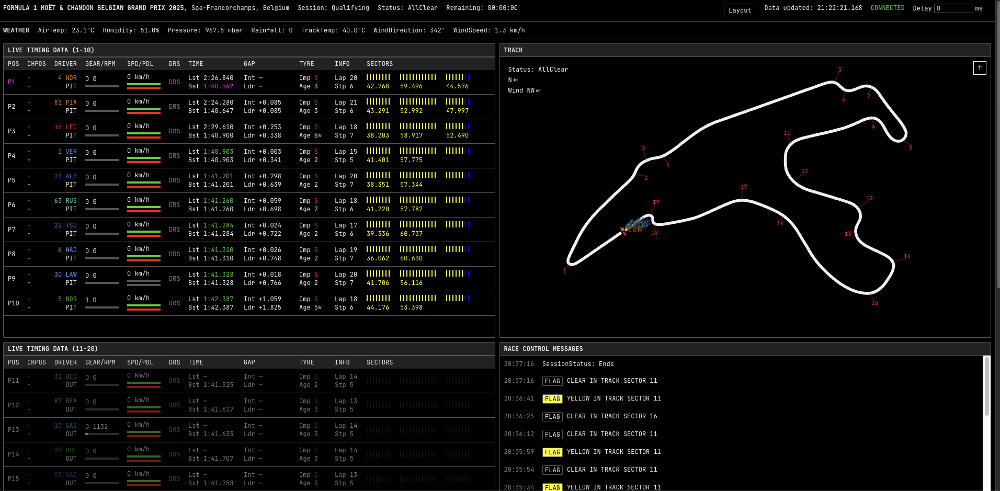
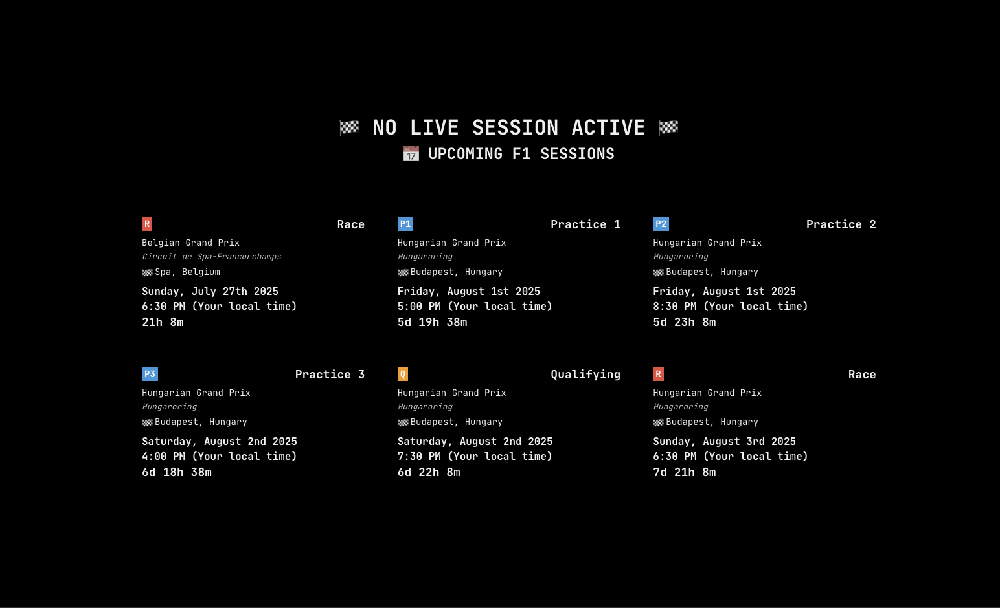

# F-1 Live Dashboard

Active during race sessions

### When Session active



### When Session Inactive



## Development

Clone the project and start it with

```
$ yarn install
$ yarn dev
```

Props: [tdjsnelling](https://github.com/tdjsnelling/monaco)
